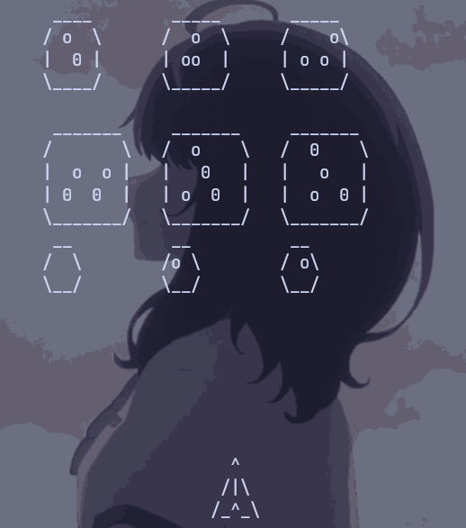

This is a simple asteroid game implemented in C++ using the ncurses library. The game features a spaceship that can be controlled using the arrow keys. The objective is to avoid the asteroids and navigate the spaceship to safety.
### Sprites

### Bash Cmd
```bash 
g++ -c objects.cpp -o objects.o
g++ main.cpp objects.o -lncurses -o build/hello
g++%                                                                                                                                                   ./build/hello
```